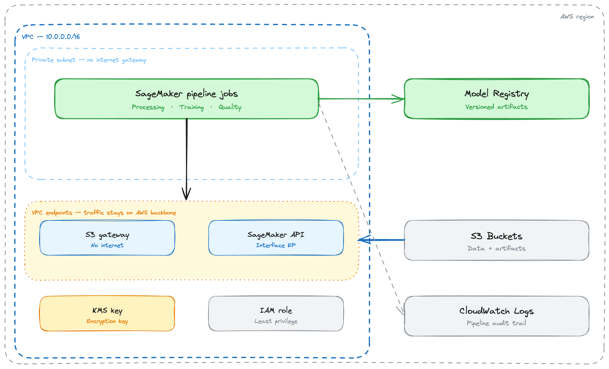
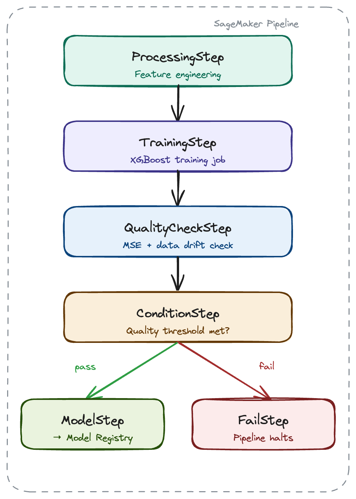

# Sagemaker Secure Pipeline

A production-ready, hardened SageMaker MLOps pipeline for fintech credit risk modeling.

Deploys a fully isolated, encrypted, governance-enforced SageMaker environment with a single command.

**Built as the reference architecture companion to [sagemaker-autopilot-demo](https://github.com/securedpress/sagemaker-autopilot-demo)** — that repo demonstrates the common misconfiguration patterns this repo remediates.

---

## Architecture

<div align="center">
  
</div>

<br/>

<div align="center">
  
</div>

---

## What this repo demonstrates

| Layer | What's built |
|---|---|
| **Infrastructure** | VPC with private subnet, no internet gateway, VPC endpoints for S3 and SageMaker API, customer-managed KMS key, least-privilege IAM role |
| **Pipeline governance** | SageMaker Pipeline with QualityCheckStep, ConditionStep, FailStep — models only reach the registry if they clear quality thresholds |
| **Cost controls** | Auto-scaling with scale-to-zero, CloudWatch alarm on idle invocations, resource tagging policy |

### Security findings remediated vs sagemaker-autopilot-demo

| Finding | sagemaker-autopilot-demo | sagemaker-secure-pipeline |
|---|---|---|
| SEC-018 — over-permissive IAM | `AmazonSageMakerFullAccess` + `AmazonS3FullAccess` | Scoped custom policy |
| SEC-020 — no KMS encryption | AES256 (AWS managed) | Customer-managed KMS key |
| SEC-022 — endpoint outside VPC | No VPC | Private subnet + VPC endpoints |
| COST-003 — no auto-scaling | Fixed instance count | Scale-to-zero on idle |

---

## Notebooks

| Notebook | Dataset | Model | Runtime | Purpose |
|---|---|---|---|---|
| `01_secure_pipeline.ipynb` | Fintech credit risk (synthetic) | Autopilot — 250+ trials | 1–4 hours | Portfolio, client demo, YouTube anchor |
| `02_xgboost_abalone.ipynb` | Abalone (UCI) | XGBoost built-in | ~10 minutes | Getting started, quick verification, YouTube episode 1 |

Both notebooks use the same hardened infrastructure — same Terraform, same VPC, same KMS key, same IAM role. The only difference is the model and dataset.


---

## Pipeline stages

```
ProcessingStep     — feature engineering + train/test split
TrainingStep       — model training (Autopilot or XGBoost)
QualityCheckStep   — AUC-ROC or RMSE threshold + data drift baseline
ConditionStep      — gate: passes only if quality thresholds are met
ModelStep          — register approved model to Model Registry (pass branch)
FailStep           — log rejection reason and halt pipeline (fail branch)
```

---

## Infrastructure layout

```
AWS Region
└── VPC (10.0.0.0/16)
    └── Private subnet — no internet gateway
        └── SageMaker pipeline jobs
            ├── ProcessingStep     — feature engineering
            ├── TrainingStep       — model training
            ├── QualityCheckStep   — metric + drift check
            ├── ConditionStep      — threshold gate
            ├── ModelStep          — register to Model Registry (pass)
            └── FailStep           — log rejection reason (fail)
    └── VPC endpoints
        ├── S3 gateway endpoint    — training data, no public internet
        └── SageMaker API endpoint — control plane, no public internet

External services (via VPC endpoints only)
├── S3              — training data + model artifacts
├── Model Registry  — versioned, approved models only
└── CloudWatch Logs — pipeline audit trail
```

---

## Prerequisites

| Requirement | Version |
|---|---|
| AWS CLI | v2+ |
| Terraform | >= 1.3.0 |
| Python | 3.8+ |

Configure AWS credentials before deploying:

```bash
aws configure
```

---

## Deployment

```bash
git clone https://github.com/securedpress/sagemaker-secure-pipeline.git
cd sagemaker-secure-pipeline

cp terraform/terraform.tfvars.example terraform/terraform.tfvars
# edit terraform.tfvars — set aws_region and owner_tag at minimum

make deploy
```

**Estimated apply time:** 5–8 minutes.

---

## Demo flow

```bash
make deploy     # provision all infrastructure
make upload     # upload training data to S3
make run        # trigger pipeline execution
make status     # poll execution status
make endpoint   # provision inference endpoint after model is approved
make destroy    # tear down all AWS resources
```

---

## Triggering the FailStep (demo)

Both notebooks include a dedicated cell that forces the FailStep by setting the quality threshold above anything the model can achieve. This demonstrates the governance layer blocking a model and producing an auditable rejection record.

```python
# 02_xgboost_abalone.ipynb — force FailStep
pipeline.start(parameters={'RMSEThreshold': 1.0})

# 01_secure_pipeline.ipynb — force FailStep
pipeline.start(parameters={'AUCThreshold': 0.99})
```

The rejection record includes the threshold value, the pipeline execution ID, and a timestamp — visible in SageMaker Studio and CloudWatch Logs.

---

## Dataset

### Notebook 01 — Fintech credit risk
Synthetic dataset modelled on cash advance repayment behaviour.
88/12 class imbalance (repaid / defaulted). Target column: `repaid`.

Baseline repayment rate: **88%**  
Pipeline result: **92.4%** (+$44K/month recovered on a $10K/day advance portfolio)

### Notebook 02 — Abalone
UCI Abalone dataset. 4,177 samples, 9 features.
Target: `rings` (proxy for age). Regression problem.

Baseline RMSE (naive mean predictor): **~3.2**  
XGBoost result: **~2.1 RMSE**

---

## Related repos

- [sagemaker-autopilot-demo](https://github.com/securedpress/sagemaker-autopilot-demo) — the before: same pipeline without the hardening layer

---

## License

MIT
